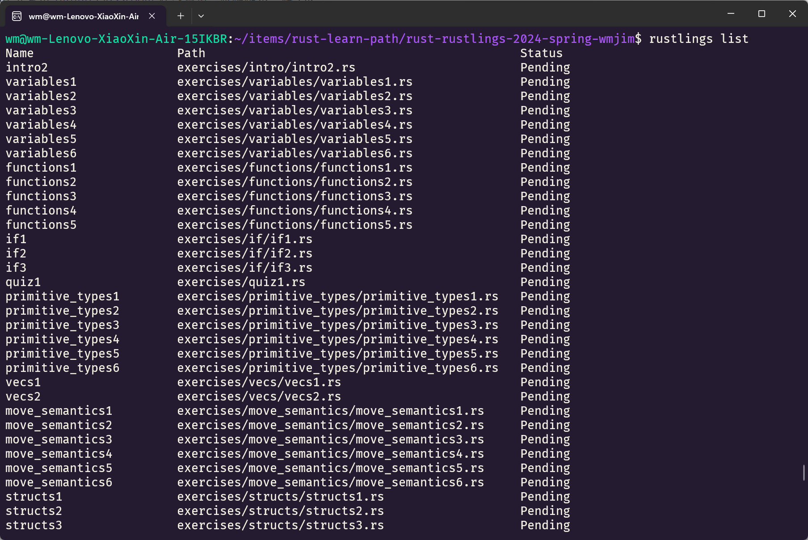
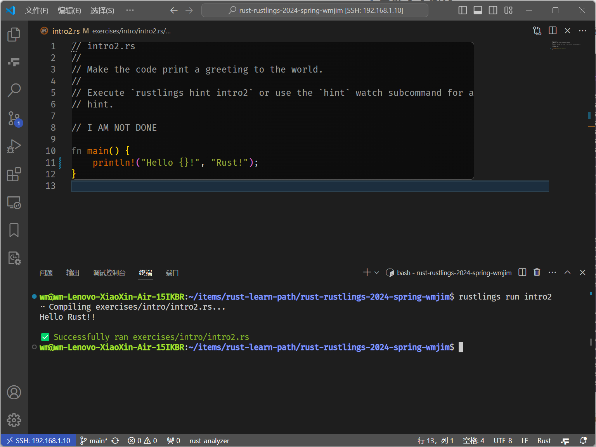
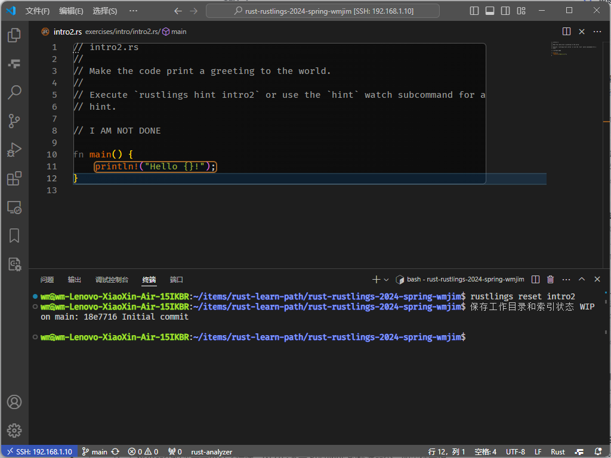
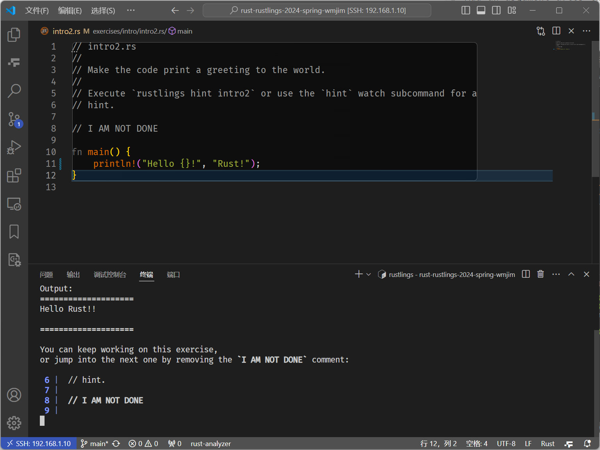

# rust 入门

## 在 Ubuntu 上安装 rust

打开终端输入以下命令：

```bash
curl --proto '=https' --tlsv1.2 https://sh.rustup.rs -sSf | sh
```

如果安装成功，将显示下行内容：

```bash
Rust is installed now. Great!
```

## 一些常用命令及VSCode插件

### 常用命令

```bash
# 更新 Rust 工具链和相关组件到最新版本。
rustup update
# 卸载 Rust，将从系统中移除 rustup，包括 rustup 安装的 Rust 工具链和相关组件。
rustup self uninstall
# 显示 rustc（Rust 编译器）和 cargo（Cargo 包管理器）版本
rustc -V # or rustc --version
cargo -V # or cargo --version

cargo new <project_name> 	# 创建一个新的 Rust 项目
cargo build 			   	# 构建当前的 Rust 项目
cargo run 					# 运行当前的 Rust 项目
cargo test 					# 运行项目中的测试
cargo check 				# 检查代码，但不生成可执行文件
cargo build --release 		# 以发布模式构建项目，生成优化后的可执行文件
cargo fmt				    # 格式化项目代码
cargo update				# 更新依赖包到最新版本
```

### VSCode 插件

- `rust-analyzer`：提供包括智能代码补全建议、错误检测、跳转到定义、重构、文档显示、代码导航等功能。
- `Even Better TOML`：为 VSCode 提供 TOML 文件的高亮显示和自动完成。
- `Monokai Pro`：一款个人喜爱的 VSCode 主题插件。

## 构建第一个 Rust 程序

使用 Cargo 工具创建一个新项目：

```bash
$ cargo new hello_world
$ tree hello_world
hello_world/
├── Cargo.toml
└── src
    └── main.rs

1 directory, 2 files
```

- `Cargo.toml`：项目配置文件，包含项目信息、依赖包信息、构建配置等。
- `src/main.rs`：项目的入口文件，包含 Rust 代码。

使用 Cargo 生成并运行程序：

```bash
$ cd hello_world
$ cargo run
   Compiling hello_world v0.1.0 (/home/wm/items/rust-learn-path/hello_world)
    Finished dev [unoptimized + debuginfo] target(s) in 0.50s
     Running `target/debug/hello_world`
Hello, world!
```

成功测试 Rust 环境，构建并运行第一个 Rust 程序。

## Rustling 训练

### 获取 Rustling 仓库

登录 github 并点击 [github classroom](https://classroom.github.com/assignment-invitations/f32787f1ff936b1bc45b8da4ffe4d738) 在线邀请，根据提示一路 OK 。

我分配到的仓库：https://github.com/LearningOS/rust-rustlings-2024-spring-wmjim

### 安装 Rustling 

本地 linux、ssh key 、rust 等环境和工具均已安装设置完毕，故不再执行，直接克隆仓库到本地。

```bash
git clone https://github.com/LearningOS/rust-rustlings-2024-spring-wmjim.git
```

进入该仓库目录，并执行以下命令安装 Rustlings：

```bash
cd rust-rustlings-2024-spring-wmjim$
cargo install --path .
```

### 一些常用的 rustlings 命令

```bash
# 显示 rustlings 所有可用的编程练习列表
rustlings list
# 运行指定的 rustlings 练习
rustlings run exercise1
# 获取某个特定练习的提示
rustlings hint exercise1
# 重置某个特定练习到初始状态
rustlings reset exercise1
# 显示 rustlings 练习的测试用例
rustlings test exercise1
```

### 习题命令测试

1. 使用 `rustlings list` 查看所有可用习题列表



2. 做 `intro2` 首个练习，并使用 `rustlings run intro2` 运行



3. 测试获取 `intro2` 练习的提示

```bash
$ rustlings hint intro2
Add an argument after the format string.
```

4. 重置 `intro2` 练习，`rustlings reset intro2`



5. 使用 `rustlings watch` 自动监视练习文件的更改，并允许对应的测试。



通过删除注释 `// I AM NOT DONE` 来跳转到下一个题目监视。

## 提交习题，查看分数

当完成部分或全部练习之后，可提交做题记录至远程仓库，并查看自己的成绩。

```bash
git add .
git commit -m "first commit and success to run intro2"
git push
```

提交出错，修改远程仓库 URL ：

```bash
git remote set-url origin git@github.com:LearningOS/rust-rustlings-2024-spring-wmjim.git
```

当在仓库中看到自己最新的提交记录之后，打开[排行榜](https://learningos.cn/rust-rustlings-2024-spring-ranking/) 搜索自己的github用户名，即可查看自己的成绩。


不过该排行榜数据更新延迟较长，需等待一段时间再进行查看。

