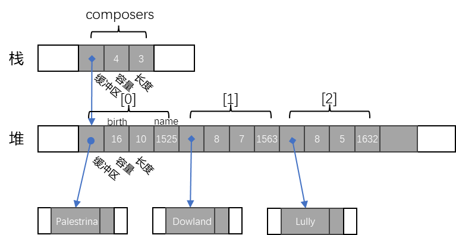
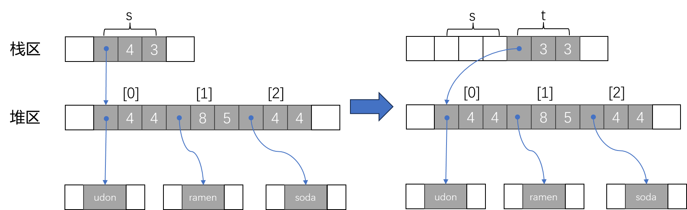
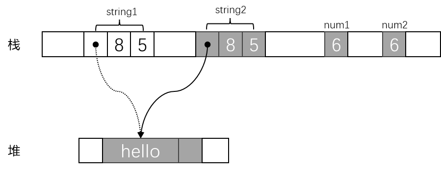

# Rust 基础知识

## 变量与可变性

在 Rust 中，使用关键字 `let` 声明变量：

```rust
let x = 5;
```

变量默认**不可改变（immutable）**，如果需要变量可变，则在声明时需要使用关键字 `mut` ：

```rust
let mut x = 5;
```

在 Rust 中，常量**总是不可变**，使用关键字 `const` 声明常量：

```rust
const THREE_HOURS_IN_SECONDS: u32 = 60 * 30 * 3; // 常量的值必须在编译时得出
```

## Rust 基本数据类型

以下总结 Rust 的基本数据类型。

### 整数型

整数型简称整型，

| 位长度（bit） | 有符号类型 | min~max          | 无符号类型 | min~max |
| ------------- | ---------- | ---------------- | ---------- | ------- |
| 8             | i8         | -2<sup>7</sup> ~ (2<sup>7</sup> -1)<br>[-128, 127] | u8         | 0 ~ (2<sup>8</sup> -1)<br>[0, 255] |
| 16            | i16        | -2<sup>15</sup> ~ (2<sup>15</sup> -1)<br>[-32768, 32767] | u16        | 0 ~ (2<sup>16</sup> -1)<br>[0, 65535] |
| 32            | i32        | -2<sup>31</sup> ~ (2<sup>31</sup> -1) | u32        | 0 ~ (2<sup>32</sup> -1) |
| 64            | i64        | -2<sup>63</sup> ~ (2<sup>63</sup> -1) | u64        | 0 ~ (2<sup>64</sup> -1) |
| 128           | i128       | -2<sup>127</sup> ~ (2<sup>127</sup> -1) | u128       | 0 ~ (2<sup>128</sup> -1) |
| arch          | isize | - | usize | - |

`isize` 和 `usize` 与目标机器上的地址空间大小保持一致，即在 32 位架构上是 32 位长，在 64 位架构上是 64 位长。

示例代码：

```rust
let signed_int: i32 = 10;
let unsigned_int: u64 = 20;
```

### 浮点类型

浮点类型有两种，`f32` 和 `f64`：

示例代码：

```rust
let float_num: f64 = 3.14;
```

### 布尔类型

布尔类型用来表示逻辑值，只包括 `true` 和 `false` 两种取值。

示例代码：

```rust
let is_rust_cool: bool = true;
```
### 字符类型

Rust 的字符类型 `char` 会以 32 位值表示单个 Unicode 字符。

示例代码：

```rust
let my_initial: char = 'F';
```

### 单元类型

`()` 类型，也称为 'unit'（单元类型），是一个零长度的元组。

`()` 常见于隐式：没有 `-> ...` 的函数隐式具有 `()` 返回类型。

```rust
fn long() -> () {}
// 等价于
fn long() {}
```

### 字面量

字面量（Literals）是代码中表示固定值的符号表示法。下面是一些常见的Rust字面量示例：

1. 整数字面量：
   - 十进制：`10`
   - 二进制：`0b1010`
   - 八进制：`0o12`
   - 十六进制：`0xA`
2. 浮点数字面量：
   - `3.14`
   - `2.0`
3. 布尔值字面量：
   - `true`
   - `false`
4. 字符字面量：
   - `'a'`
   - `'b'`
5. 字符串字面量：
   - `"Hello, world!"`
   - `"Rust is awesome!"`

## 复合类型

### 元组类型

元组（Tuple）允许将多个不同类型的值组合在一起。其大小、值和类型都是固定的，一旦声明之后便不能更改。

元组的声明和访问使用方式如下：

```rust
let tup: (i32, f64, u8) = (500, 6.4, 1);
// or 下面这种方式
let tup =  (500, 6.4, 1);
// 使用 (.) 后跟索引访问  
tup.0; // 500
tup.1; // 6.4
tup.2; // 1
// 模式匹配结构元组值
let (x, y, z) = tup; 
```
### 数组类型

数组（Array）是一种大小固定、元素类型相同的集合类型。

数组的声明使用方式如下：

```rust
// 简单写法
let a = [1, 2, 3, 4, 5];
// 标注元素类型及个数
let a: [i32; 5] = [1, 2, 3, 4, 5];
// 技巧：创建值相同数组
let a: [3; 5]; // a = [3, 3, 3, 3, 3];

// 访问值
a[0]; // 1
// 修改值
a[1] = 5;
```
### Vector

动态数组类型用 `Vec<T>` 表示，它允许你存储多个值，这些值在内存中一个紧挨着另一个排列，因此访问其中某个元素的成本非常低。

**创建动态数组:**

```rust
// 使用 Vec::new 创建动态数组
let v: Vec<i32> = Vec::new();
// 使用宏 vec! 来创建动态数组
let v = vec![1, 2, 3];
```

**向数组尾部添加元素，可以使用 `push` 方法：**

```rust
let mut v = Vec::new();
v.push(1);
```

## 字符串

### 切片

切片允许你引用集合中部分连续的元素序列，而不是引用整个集合。

对于字符串而言，切片就是对 `String` 类型中某一部分的引用：

```rust
let s = String::from("hello world");

let hello = &s[0..5];
let world = &s[6..11];
// 从索引 0 开始
let slice = &s[..2];
// 包含最后一个索引
let slice = &s[4..];
// 截取完整的 String 切片
let slice = &s[..];
```

### 字符串字面量

在Rust中，**字符串字面量**是一种表示固定字符串值的文本表示法。它们由双引号括起来，并且可以包含任意Unicode字符序列。

字符串字面量在Rust中的类型是 `&str`，它是一个指向存储在程序代码中的静态字符串数据的不可变引用。

```rust
let s = "Hello, world!"; // "Hello, world!"是字符串字面量
```

### 字符串切片

**字符串切片**（String slice）是一种特殊的数据类型，表示对字符串的引用，它允许对字符串进行切片操作，而不需要拷贝原始字符串的内容。字符串切片的类型是 `&str`。

```rust
let s = "Hello, world!"; // 字符串字面量
let slice = &s[0..5];     // 创建一个字符串切片，包含 "Hello"，从索引 0 到索引 5（不包括索引 5）
```

### 字符串

`String`类型是Rust标准库中提供的一个可增长的、可变的、有所有权的字符串类型。

```rust
let mut string = String::from("Hello");
string.push_str(", world!"); // 追加
String.insert_str(6, " I like"); // 插入
let new_string = string.replace("Hello", "HELLO"); // 替换
new_string.pop(); // 删除
let con_string = new_string + string; // 连接
```

## 结构体

Rust 有 3 种结构体类型：**命名字段结构体**、**元组结构体**、**单元结构体**。

### 命名字段结构体

定义结构体：

```rust
struct User {
    active: bool,
    username: String,
    email: String,
    sign_in_count: u64,
}
```

创建结构体实例：

```rust
let user1 = User {
    email: String::from("Alice@gmail.com),
    username: String::from("Alice"),
    active: true,
    sign_in_count: 1,
};
```

访问结构体字段：

```rust
let mut user1 = User {
    email: String::from("Alice@gmail.com),
    username: String::from("Alice"),
    active: true,
    sign_in_count: 1,
};
user1.eamil = String::from("Lucy@gmail.com");
```

结构体更新语法：

```rust
// 使用结构体更新语法创建新实例，基于已有的实例进行更新
let user2 = User {
    email: String::from("new@example.com"),
    username: String::from("new_user"),
    ..user1 // 使用 ..user1 表示基于 user1 进行更新，保留未显示指定的字段值
};
```

字段初始化简写：

```rust
// 使用简写语法创建结构体实例
// 如果字段名和变量名相同
let username = String::from("Alice");
let email = String::from("Alice@gmail.com");
let active: true;
let sign_in_count = 1;
let user1 = Person { active, username, email, sign_in_count };

// 如果字段名和变量名不同
let full_name = String::from("Alice");
let user2 = Person { active, username: full_name, email, sign_in_count };
```

### 元组结构体

**元组结构体（Tuple Struct）**是 Rust 中的一种特殊结构体类型，它结合了元组的特性和结构体的命名字段。与普通结构体不同，元组结构体的字段没有名称，而是按顺序排列的元组。

```rust
// 声明元组结构体
strcut Point(i32, i32, i32);
let origin = Point(0, 0, 0);

// 访问元组结构体的字段
let x_coordinate = origin.0;
let y_coordinate = origin.1;
```

元组结构体适用于那些需要组合不同类型数据，但又不需要为每个字段命名的情况。

### 单元结构体

**单元结构体（Unit Struct）**也是 Rust 中的一种特殊结构体类型，它不包含任何字段和属性，本质上类似于一个空的元组 `()` 。

你可能会在某个模块中定义一个单元结构体，用于实现一个 trait，以便在其他地方使用该 trait。

```rust
struct Displayable;

trait Display {
    fn display(&self);
}

impl Display for Displayable {
    fn dispaly(&self) {
        println!("This is a displayable item.");
    }
}

fn main() {
    let item = Displayable;
    item.display();
}
```

对于单元结构体，Rust 既不会在内存中实际存储单元结构体的值，也不会生成代码来对它进行操作，仅通过值的类型就能知道关于值的所有信息。

## 函数

函数（Function）是一种可调用的代码块，用于执行特定的任务和操作。

一个简单函数示例：

```rust
fn add_one(x: i32) -> i32 {
    x + 1 // 返回 x + 1 的结果
}
```

函数支持以下特性：

1. **参数和返回值**：函数可以接受参数并返回一个值，且参数和返回值都需要指定类型。
2. **函数签名**：函数声明包括函数名、参数列表和返回类型，可以显式指定或使用类型推断。
3. **可变参数**：函数参数可以是可变的，在参数名前加 `mut` 关键字。
4. **函数重载**：通过函数名相同，但参数类型或个数不同。

## Rust 流程控制

### if 表达式

if 表达式根据条件不同来执行不同的代码块，同时支持 `if-else` 和 `if-else if-else` 结构。

简单示例如下：

```rust
let num = 5;
if num < 0 {
    // code
} else if num == 0 {
    // code
} else {
    // code
}
```

除此之外，Rust 还支持在表达式中使用 `if-else`，这对做一些简单条件赋值很有用。

```rust
let condition = true;
let number = if condition {5} else {7};

```

### loop 循环

loop 关键字用于创建一个无限循环，它会一致执行其中的代码，直到遇到 `break` 语句跳出循环。

一个简单的 `loop` 循环示例如下：

```rust
let mut counter = 0;
loop {
    println!("The counter is: {}", counter);
    if counter >= 5 {
        break;  // 当计数器大于等于5时跳出循环
    }
    counter += 1;
}
```

### 循环标签

如果存在嵌套循环，`break` 和 `continue` 应用于此时最内层的循环。你可以选择在一个循环上指定一个**循环标签**（loop lable），然后将标签于 `break` 或 `continue` 一起使用，使这个关键字应用于已标记的循环而不是最内层的循环。

```rust
let mut count = 0;
'counting_up': loop {
    let mut remaining = 10;

    loop {
        if remaining == 9 {
            break;  // 跳出内部循环
        }
        if count == 2 {
            break 'counting_up'; // 跳出外部带标签的循环
        }
        remaining -= 1;
    }
    count += 1;
}

```

### while 循环

`while` 循环用于根据条件重复执行代码块，只要条件为 `true`，循环就会继续执行，直到条件为 `false` 。

一个简单的 `while` 循环示例：

```rust
let mut counter = 1;
while counter <= 5 {
    counter += 1;
}
```

### for 循环

`for` 循环用于遍历集合中的元素，例如数组、范围、迭代器等。`for` 循环能够以一种简洁的方式遍历集合中的每个元素并执行相应的操作。

`for` 循环常见用法示例：

```rust
// 遍历数组
let fruits = ["apple", "banana", "cherry"];
for fruit in fruits.iter() {
    println!("I like {}", fruit);
}

// 遍历数字范围
for number in (1..=5) {
    println!("The number is: {}", number);
}

// 遍历字符串中的字符
let message = "Hello";
for c in message.chars() {
    println!("The character is: {}", c);
}
```

## 所有权

所有权这部分可以看看这篇文章：http://wmjim.cn/posts/a8b6e44d.html

### 所有权规则

Rust 所有权规则如下：

1. Rust 中的每一个值都有一个被称为其 **所有者（owner）** 的变量。
2. 值在任意时刻有且仅有一个所有者。
3. 当所有者（变量）离开其作用域时，这个值将被丢弃。

### 变量作用域

作用域是一个变量在程序中有效的范围。

```rust
{                                     // s 在这里无效，因为它此时尚未声明
    let s = String::from("hello");    // 从此处起，s 开始有效 
}                                     // 此作用域结束，s 不再有效
```

将 `String` 类型 "hello" 绑定到变量 `s` 上，`s` 就作为了 `String` 类型 "hello" 的所有者。当 `s` 变量离开作用域，Rust 会自动调用一个特殊的释放内存的 `drop()` 函数，这种释放的行为也被称为 **丢弃（drop）**。

### 所有权树

一个拥有一个值的所有者，可以很容易地决定何时丢弃它，但是一个拥有多个值，并且每个值可能会拥有许多其它值的所有者呢？

```rust
struct Person { name: String, birth: i32 };

let mut composers = Vec::new();
composers.push( Person { name: "Palestrina".to_string(),
                            birth: 1525});

composers.push( Person { name: "Dowland".to_string(),
                            birth: 1563 } );

composers.push( Person { name: "Lully".to_string(),
                            birth: 1632 });

```

`composers` 在内存中的表示如下：



`composers` 中的每个元素都各自拥有一个字符串，该字符串又拥有自己的文本。所有者及其拥有的那些值形成了一棵树，这颗树就是 **所有权树**。

值的所有者是值的父节点，值所拥有的值是值的子节点。每棵树的总根都是一个变量，当该变量超出作用域时，整棵树都将随之销毁。

### 转移所有权

Rust 中的基本数据类型，包括所有的**机器整数类型**、**浮点数类型**、**char 类型**、**bool 类型**，以及 **Copy 类型的元组**或**固定大小的数组**进行赋值时会**复制**整个值。例如：

```rust
let x = 5;
let y = x;
```

将 5 绑定到变量 `x`，接着拷贝 `x` 的值赋给 `y`，最终 `x` 和 `y` 都等于 5。

而对于涉及到**向量**、**字符串**和**其它可能占用大量内存且复制成本高昂的类型**，在进行赋值时则使用**移动**语义。例如：

```rust
let s1 = String::from("hello");
let s2 = s1;
```

将 `s1` 对 `String` 类型 "hello" 的所有权移动到了 `s2` 身上，之后 `s1` 不再指向任何数据，只有 `s2` 是有效的。当 `s2` 离开作用域时，会释放内存。

### 移动（move）

在 Rust 中对大多数类型，像为变量赋值、将其传给函数或从函数返回这样的操作都不会复制值，而是会移动值。值的源会把值的所有权转移给目标并变回未初始化状态，改为目标变量来控制值的生命周期。举例：

```rust
let s = vec!["udon".to_string(), "ramen".to_string(), "soba".to_string()];
let t = s;
```

纯字符串字面量（如，"udon"）存储在栈中，而为了清晰地说明移动语义，调用 `to_string()` 方法以获取堆上分配的 `String` 值。

该赋值操作在内存中的表示如下：



初始化语句 `let t = s;` 将向量的 3 个标头字段从 `s` 转移给了 `t`，现在 `t` 拥有了该向量的所有权，`s` 则变回了未初始化状态。

如果此时我们再执行 `let u = s;`，编译器会拒绝执行此代码并报出如下错误：

```rust
error[E0382]: use of moved value: `s`
 --> src/main.rs:4:13
  |
2 |     let s = vec!["udon".to_string(), "ramen".to_string(), "soba".to_string()];
  |         - move occurs because `s` has type `Vec<String>`, which does not implement the `Copy` trait
3 |     let t = s;
  |             - value moved here
4 |     let u = s;
  |             ^ value used here after move
  |
help: consider cloning the value if the performance cost is acceptable
  |
3 |     let t = s.clone();
  |              ++++++++

For more information about this error, try `rustc --explain E0382`.
warning: `hello_world` (bin "hello_world") generated 2 warnings
error: could not compile `hello_world` (bin "hello_world") due to previous error; 2 warnings emitted
```

按照编译器报错提示，如果想要显式地同时访问 `t` 和 `s`，必须显式地进行复制，Rust 提供 `clone()` 方法，该方法会执行向量及其元素的深拷贝。

```rust
let s = vec!["udon".to_string(), "ramen".to_string(), "soba".to_string()];
let t = s.clone();
let u = s.clone();
```

### 克隆（copy）

对整数或字符这样的简单数据类型，在编译时是已知大小的，会被存储到栈上，再进行如此谨小慎微地移动处理实在没有必要。Rust 中有一种叫做 **Copy** 的 trait，可以用在此类简单数据类型的处理。

举例，比较 copy 和 move 的差异：

```rust
let string1 = "hello".to_string();
let string2 = string1;

let num1: i32 = 6;
let num2 = num1; 
```

这段代码在内存中的表示如下：



赋值会将 `string1` 的所有权转移给 `string2`，这样就不会出现两个字符串放在同一个缓冲区的情况。但是 `num1` 和 `num2` 的情况则有所不同，`i32` 只是内存中的 4 个字节，它不拥有任何堆上的资源，也不会依赖除自身字节之外的任何内存。因此当将 `num1` 赋值给 `num2` 时，其实是为 `num2` 制作了一个完全独立的副本。

以下是具有 **copy trait** 的类型：

- 所有的整数类型，如 `i32`。
- 布尔类型 `bool`，`true` or `false`。
- 所有的浮点数类型，如 `f64`。
- 字符类型，`char`。
- 元组，当且仅当其包含的类型也都是具有 copy trait 的时候，如 `(i32, i32)` 是 **copy** 的，但是 `(i32, String)` **不是 copy** 的。
- 不可变引用 `&T`。

## 引用和借用

### 不可变引用（Immutable References）

不可变引用允许对数据进行只读访问，并且可以同时存在多个不可变引用。引用通过 `&` 符号来创建。例如：

```rust
let x = 5;
let y = &x; // y 是 x 的引用
```
这里 `y` 是 `x` 的引用，但 `x` 仍然拥有那个值。

### 借用（Borrow）

借用是使用引用的一种方式。当我们借用一个值时，我们可以在不取得其所有权的情况下使用它。这意味着借用者（借用值的变量或函数）可以在不担心修改或删除原始值的情况下使用它。

```rust
fn print_value(value: &i32) {
    println!("{}", value);
}

let x = 5;
print_value(&x); // 这里我们借用了 x，但 x 的所有权没有转移
```
在这个例子中，`print_value` 函数借用了 `x` 的值，但 `x` 仍然拥有那个值，并且在函数调用结束后仍然可以使用 `x`。

> 不可变引用和借用都是用来允许对数据进行只读访问，而不转移数据的所有权。因此，在实际使用中，不可变引用和借用所代表的意义是相似的。

### 可变引用（Mutable References）

如果我们想修改借用的值，我们需要使用可变引用，通过 `&mut` 符号来创建。但是，Rust 对于可变引用有非常严格的规则：

- 不可变引用可以同时有多个。（可以有多个读者）
- 不可变引用存在的同时不能有可变引用（读者写者不能共存）
- 不能同时有多个可变引用。（多个写者不能共存）

```rust
let mut x = 5;
{
    let y = &mut x; // y 是 x 的可变引用
    *y += 1;        // 通过可变引用修改 x 的值
}
println!("{}", x); // 输出 6，因为 y 的修改生效了
```
