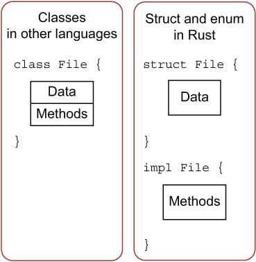

# 方法 Method

Rust 的方法往往和结构体、枚举、特征（Trait）一起使用。

## 定义方法

Rust 使用 impl 定义方法，代码如例：

```rust
struct Circle {
    x: f64,
    y: f64,
    radius: f64,
}

impl Circle {
    fn new(x: f64, y: f64, radius: f64) -> Circle {
        Circle {
            x: x, 
            y: y,
            radius: radius,
        }
    }

    fn area(&self) -> f64 {
        std::f64::consts::PI * (self.radius * self.radius)
    }
}
```

以下图片展示了 Rust 方法定义与其它语言的方法定义做了对比：



## self、&self 和 &mut self

在 Rust 中，`self` 、`&self` 和 `&mut self` 是方法参数的不同形式，它们决定了方法如何访问调用它的对象。主要区别在于它们对对象所有权的处理方式。

`self`：

- **所有权转移**：当方法使用 `self` 作为参数时，它将调用它的对象的 `ownership` 。这意味着方法结束后，对象的所有权将被转移到方法内部，原来对象将不再生效。
- **使用场景**：通常用于需要完全控制对象的情况，比如当对象需要在方法内部被销毁或转换成其它类型时，这种形式用的较少。

`&self`（借用）：

- **不可变借用**：`&self` 表示方法对对象的进行不可变借用。这意味着方法可以读取对象的属性，但不能修改它们。
- **使用场景**：适用于哪些不需要修改对象状态的方法，比如获取对象信息或执行只读操作。

`&mut self`（可变借用）：

- **可变借用**：`&mut self` 允许方法对对象进行可变借用，这意味着方法可以读取和修改对象的属性。
- **使用场景**：用于需要修改对象状态的方法。由于 `&mut self` 需要独占访问，因此在任何给定时间，只能有一个可变借用存在。

代码示例如下：

```rust
struct Point {
    x: i32,
    y: i32,
}

impl Point {
    // &self 用于不可变方法
    // 在方法签名中，可以在 self 后增加多个参数，而且这些参数就像函数中的参数一样工作。
    fn distance(&self, other: &Point) -> f64 {
        let dx = (other.x - self.x) as f64;
        let dy = (other.y - self.y) as f64;
        (dx.powi(2) + dy.powi(2)).sqrt()
    }
    
    // &mut self 用于可变方法
    
    fn move_by(&mut self, dx: i32, dy: i32) {
        self.x += dx;
        self.y += dy;
    }
    
    // self 用于转移所有权的方法
    fn consume(self) {
    }
}
```

## 关联函数

在 Rust 中，关联函数（associated functions）是定义在 `impl` 块中，但不以 `self` 作为第一个参数的函数。

代码示例如下：

```rust
struct Point {
    x: i32,
    y: i32,
}

impl Point {
    // 关联函数，创建新的 Point 实例
    fn new(x: i32, y: i32) -> Point {
        Point {x, y}
    }
    
    // 实例方法
    fn move_by(&mut self, dx: i32, dy: i32) {
        self.x += dx;
        self.y += dy;
    }
}
```

**关联函数的特点：**

1. **与类型关联**：关联函数在 `impl` 块中定义，与特定的类型相关联。
2. **不需要实例**：与实例方法不同，关联函数不要求有一个类型的实例存在。
3. **命名空间**：关联函数通常与类型共享相同的命名空间，可以通过类型名直接调用。

**关联函数的使用场景：**

1. **构造函数**：使用关联函数创建类型的实例。
2. **静态方法**：关联函数可以执行与类型相关的操作，但不需要特定的实例。
3. **工厂方法**：可以用来创建同一类型的不同变体或实现。

## 多个 impl 定义

Rust 允许为一个结构体定义多个 `impl` 块，当方法多了后，可以把相关的方法组织在同一个 `impl` 块中，那么就可以形成多个 `impl` 块。

代码示例如下：

```rust
impl Rectangele {
    fn area(&self) -> u32 {
        self.width * self.height
    }
}

impl Rectangle {
    fn can_hold(&self, other: &Rectangle) -> bool {
        self.width > other.width && self.height > other.height
    }
}
```

## 枚举方法

```rust
enum Message {
    Quit,
    Move {x: i32, y: i32},
    Write(String),
    ChangeColor(i32, i32, i32),
}

fn Message {
    fn call(&self) {
    }
}
```

